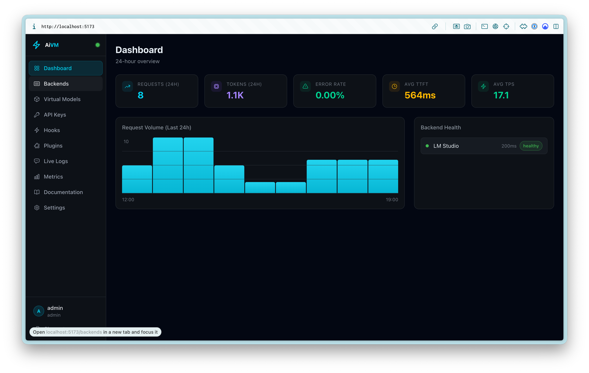
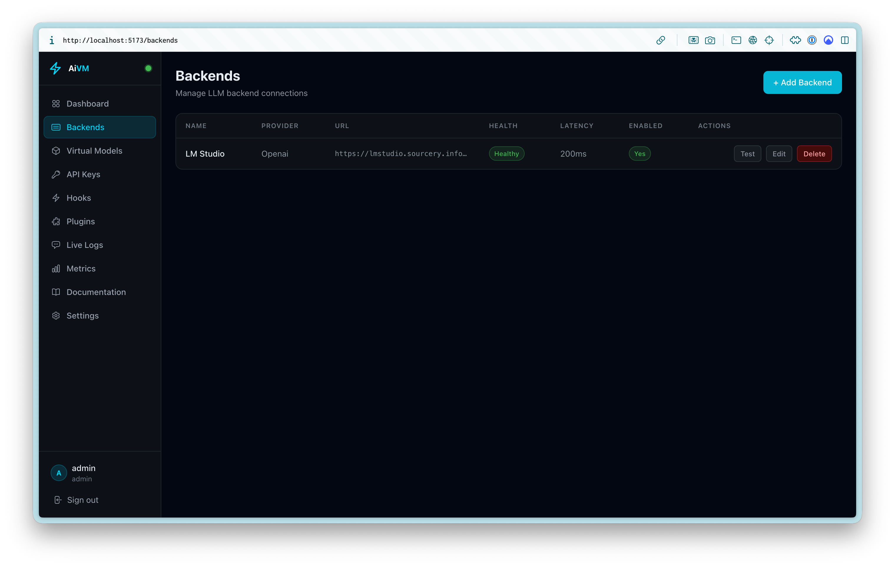
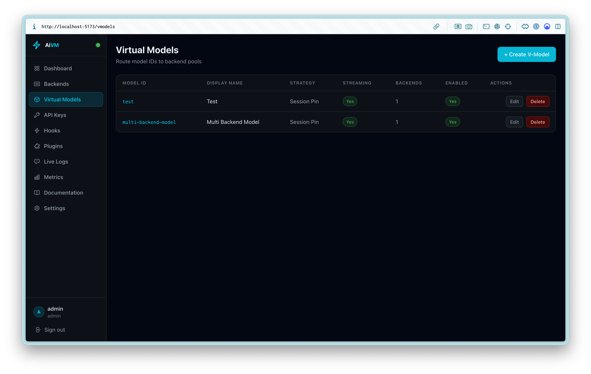
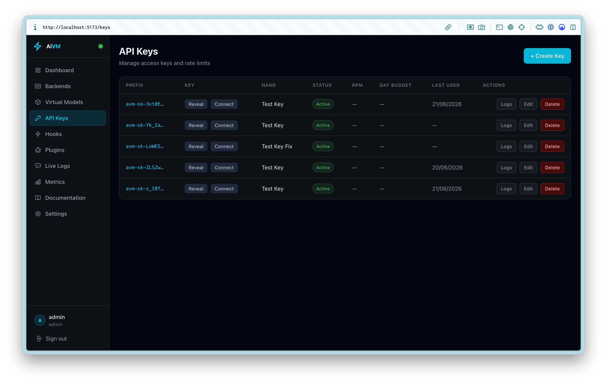
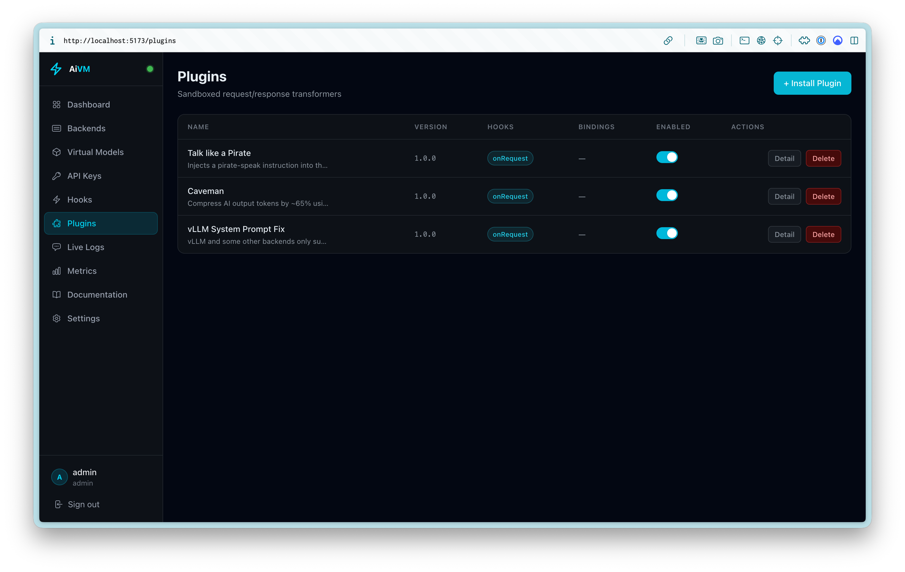
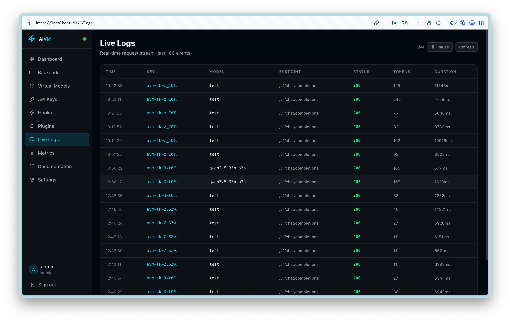
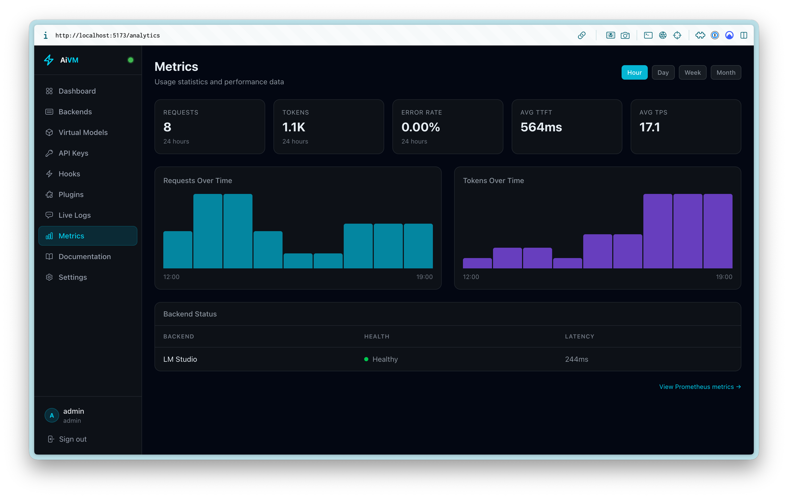

# ai-v-models

Modern streaming reverse proxy for OpenAI-compatible LLMs. Built for homelab users and sysadmins who need to manage access to multiple LLM backends across different machines.

Like HAProxy or Nginx, but purpose-built for LLMs — with virtual models, key management, load balancing, hooks, plugins, and a full admin UI.



## Features

- **Streaming proxy** — Full SSE pass-through with token counting, TTFT tracking, and TPS metrics
- **Virtual models (v-models)** — User-facing aliases that map to one or more backends with configurable load-balancing strategies
- **Key management** — Create, scope, rate-limit, and audit API keys with per-key usage logs
- **Load balancing & HA** — Session pinning, round-robin, weighted, and automatic failover with health checks and circuit breakers
- **Plugins** — Sandboxed request/response transformers you install from npm or GitHub (e.g. system-prompt injection, vLLM compatibility fixes)
- **Hooks** — Pre-request mutation and post-completion callbacks (internal worker threads or external webhooks)
- **Web admin UI** — Built-in SvelteKit dashboard for everything: backends, v-models, keys, plugins, live logs, and metrics — served from the same port as the API
- **CLI (`aivm`)** — Full management from the terminal for scripting and automation
- **Observability** — Prometheus metrics, OpenTelemetry OTLP export, structured logging, and real-time SSE dashboards

## Web admin UI

AiVM ships with a polished dark-mode admin interface — no separate deployment required. In production it is served at `/` on the proxy port; in development it runs on `:5173` with the API proxied behind it.

Log in with the default admin account on first run (`admin` / `changeme123` — change this immediately in **Settings**). The UI also supports TOTP 2FA, WebAuthn passkeys, and admin API tokens for automation.

### Backends

Add, test, and monitor LLM upstreams from the UI or CLI. Health status and latency are shown at a glance.



### Virtual models

Define user-facing model aliases (`smart-chat`, `fast-summarizer`, …) that route to one or more backends. Choose balancing strategies, streaming behaviour, and per-backend weights without exposing internal model IDs to clients.



### API keys

Issue keys with optional rate limits, token budgets, model scopes, and expiry. Reveal keys once at creation, then browse per-key request logs from the UI.



### Plugins

Install sandboxed TypeScript plugins that transform requests and responses at the edge — no filesystem or network access inside the isolate. Bind plugins globally or to specific v-models. Example plugins in the repo include pirate-speak injection, token compression, and vLLM system-prompt fixes.



Author your own with the [`@ai-v-models/plugin-sdk`](packages/plugin-sdk/) — see [Plugin Authoring](docs/guide/plugin-authoring.md).

### Live logs & metrics

Watch requests stream in real time with key, model, status, token count, and duration. The metrics page adds charts for requests and tokens over time, error rates, TTFT, TPS, and backend health — with a link through to Prometheus.





## Supported providers

LM Studio, Ollama, vLLM, OpenAI, and generic OpenAI-compatible backends.

## Quick start

### Requirements

- Node.js 22+
- pnpm 9+
- An LLM backend (LM Studio, Ollama, vLLM, etc.)

### Install and run

```bash
git clone https://github.com/j-norwood-young/ai-v-models.git
cd ai-v-models
pnpm install
pnpm build
pnpm start
```

This starts the proxy on **http://localhost:4000** with:

- OpenAI-compatible API at `/v1/*`
- Management API at `/api/v1/*`
- Admin UI at `/`

Data is stored in `~/.ai-reverse-proxy/`. On first run an admin user is created with password `changeme123` — **change it immediately** in Settings after logging in.

### Docker

```bash
docker compose up
```

Runs on port 4000 with data in a Docker volume. See [docs/guide/docker.md](docs/guide/docker.md) for details.

## Usage

Everything below can also be done from the web admin UI.

### Add a backend

```bash
pnpm aivm backend add \
  --name lmstudio-bob \
  --url http://192.168.1.100:1234 \
  --provider lmstudio \
  --hostname bob
```

### Create an API key

```bash
pnpm aivm key create --name "my-app"
```

Save the key when shown — it is only displayed once.

### Chat completion

```bash
curl http://localhost:4000/v1/chat/completions \
  -H "Authorization: Bearer aivm-sk-YOUR_KEY" \
  -H "Content-Type: application/json" \
  -d '{
    "model": "qwen3.5-35b:bob:lmstudio",
    "messages": [{"role": "user", "content": "Hello!"}],
    "stream": true
  }'
```

Models are namespaced as `<model>:<hostname>:<provider>`, e.g. `qwen3.5-35b:bob:lmstudio`. Virtual models are simpler aliases like `smart-chat`.

## Configuration

Environment variables (prefix `AIVM_`):

```bash
AIVM_PORT=8080 AIVM_LOG_LEVEL=info pnpm start
```

Or `~/.ai-reverse-proxy/config.yaml`:

```yaml
server:
  port: 4000
log:
  level: info
  format: pretty
```

Copy `.env.example` to `.env` for a full list of options.

## Documentation

Full docs live in [docs/](docs/):

- [Introduction](docs/guide/introduction.md)
- [Quick start](docs/guide/quickstart.md)
- [Web UI](docs/guide/web-ui.md)
- [Configuration](docs/guide/configuration.md)
- [CLI reference](docs/guide/cli.md)
- [Virtual models](docs/guide/vmodels.md)
- [Plugins](docs/guide/plugin-authoring.md)
- [Hooks](docs/guide/hooks.md)
- [Docker](docs/guide/docker.md)
- [Kubernetes](docs/guide/kubernetes.md)

Build and serve the docs site locally:

```bash
pnpm dev:docs
```

## Development

```bash
pnpm install
pnpm dev          # proxy + web UI
pnpm dev:proxy    # proxy only
pnpm dev:web      # web UI only
pnpm test
pnpm lint
pnpm typecheck
```

## Project structure

```
apps/web/          Admin UI (SvelteKit)
packages/proxy/    Reverse proxy server
packages/core/     Shared config, DB, types
packages/cli/      aivm CLI
packages/hooks-sdk/  Hook authoring SDK
packages/plugin-sdk/ Plugin authoring SDK
docs/              VitePress documentation
examples/plugins/  Example sandboxed plugins
```

## License

[MIT](LICENSE)
